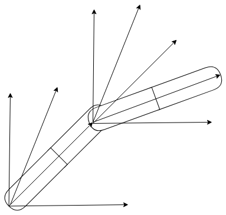
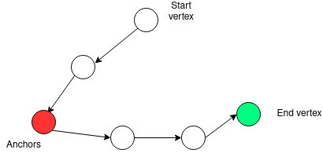

# Path planning for a robotic arm using node graph 

# Contributor
The contributors to this project are:
1. Nguyen Viet Bach - https://github.com/bachnguyenviet
2. Nguyen Viet Tung - https://github.com/VTNguyen490

# Description 

 In this project, We will try to explore the capability to control a robotic arm to avoid obstacles using nodes graph; our goal is to control the robotic arm UR5 by diving the operational space into a node graphs with which we are able to use algorithm such as D* or A* to find the shortest path to a certain point. 

 Specificially, each link of the UR5 can only move with a certain resolution creating nodes each describing a distinct pose of the end effector; The nodes graph sructure also allows us to avoid obstacles by simply disabling the connecctions to nodes in which the UR10 collide with obstacles.

 The UR10 has 6 moveable joint; we only use 5 of them since the last joint is only for rotating the gripper. The resolutions fand operating range for 5 of the links are:
 1. First link : range 0 - 180 degree, resolution : 30 degree
 2. Seccond link : range 0 - 180 degree, resolution : 15 degree
 3. Third link : range 0 - 180 degree, resolution : 15 degree
 4. Forth link : range 0 - 90 degree, resolution : 30 degree
 5. Fifth link : range 0 - 90 degree, resolution : 30 degree

 ###

 

 
 <figcaption>Setup of the project</figcaption>
 
 

 # Methodology 

 ### Core idea

 First and foremost, we let each link moves with a certain resolution creating nodes, each node with a speccific pose (position and orientation). Doing this over a certain range for every link gives us a list of reachable points in the operation space

 

 
 <figcaption>Each link moves with certain resolution</figcaption>
 
 
  
 ###

 

 
 <figcaption>Simulated map of the reachable points</figcaption>
 
 

 ### 

 After that, we divide the operating space into a set of smaller subspaces, or a tiny "box" to understand simply, and each point is classified based on the boxes that they lie in. Subsequently, every goal position is then classified in a similar fashion so that we can immediately know wht are the angular displacement of each link to reach the target with relative accuracy. Note that you can still constraint the orientation of the end effector, and in which case, we just need to check all the potetnial solution for the one with matching orientation to a relative degree. 

 And finally, after obtaining the graph, we apply D* or A* algorithm (or any path planning algorithm you like) to find the shortest path to the destination. However, due to the sheer number of nodes in the graph, it is very challenging and costly in term of computational power to find the shortest paths for every node possible; and therefore, we employ an set of anchors acting as the start vertex for the D* or A* algorithm and every other paths from different start vertex are traced using their shortest paths. In this project, 63 anchors are used and more can be employed to improve the result.

 

 
 <figcaption>Path finding using anchors</figcaption>
 
 

### Avoid obstacles

 Like I have mentioned before, avoiding obstacles can be a simple task with this approach since you only need to disable nodes which collide with the obstacles (given the resolution is not to low). This is accomplished by simply using CoppeliaSim collision checking function to obtain colliding node and subsequently, we can exclude them out of the graph 

### How to run 

This project require CoppeliaSim and ROS2 interface to work so follow the instruction on this page for setting up: https://uark-meeg-intro-robo.readthedocs.io/en/latest/coppelia.html

Here is the instruction how to create all the neccessary file and run from scratch:

1. Open and run the Coppelia scene : ./CoppeliaScenes/test_link_displacement_avoid_obstacles_simulate_result.ttt in order to obtain the node list with the exclusion of node colliding with obstacles (change the directories in the script to where you want the files to be saved)

2. Run the python file djikstra_refine_not_count_collided.py
( this may take very long depending on the number of anchors and  also change the path to match first step )

3. Run the python file test_avoid_obstacles.py

4. Run the Coppelia scene ./CoppeliaScenes/test_link_displacement_avoid_obstacles_.ttt.

In the folder 30_15_15_30_30, most ofthe necessary files have been included, you just need to run the test_avoid_obstacles.py and the Coppelia scene /CoppeliaScenes/test_link_displacement_avoid_obstacles_.ttt. However, if you want to run the file djikstra_refine_not_count_collided.py, you have to run everything over again since one of the required files can not be uploaded due to its size ( ~ 1.1 GB ) 

Once everything is setup, you can just run the Coppelia scene /CoppeliaScenes/test_link_displacement_avoid_obstacles_.ttt and the python file test_avoid_obstacles.py following the order in the instruction. Note that if you change the location of the obstacles than you must run everything over again. And it is also important to note that since the UR10 does not look like a conventional Robotic arm that people are used to, it is recommended to use the function calculate_end_effector() for testing and not just make up a random point 

# Conclusion

While once up and running, this approach to control the robotic arm is fast, easily manuverable but only with a certain degree of accuracy and take a lot of time for the initial procesing 
